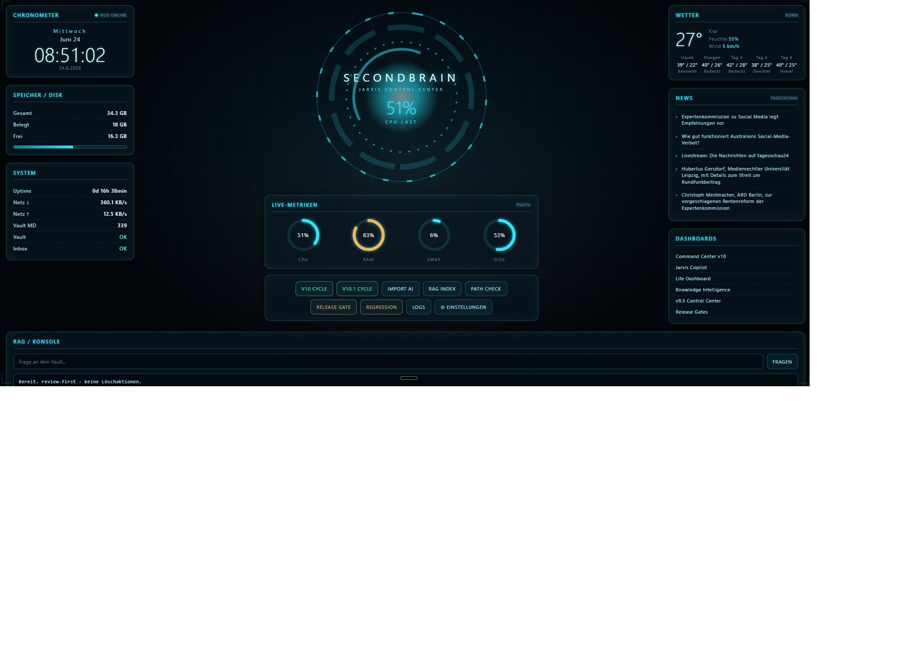

# SecondBrain-Agent v30.25

Lokaler Jarvis-/SecondBrain-Agent mit modularer Runtime, nativer Desktop-Oberflaeche, deutscher Sprachsteuerung, P1-RAG, Desktop-Kommandos, Voice, Knowledge Graph, Mobile Companion und Release-Gates.

## Projektwurzel

Alle Befehle laufen aus dem Projektordner:

```powershell
cd H:\SecondBrainAgent\SecondBrain-Agent
```

Wenn Befehle aus `H:\SecondBrainAgent` gestartet werden, findet Python `launcher.py`, `pytest.ini`, `pyproject.toml` und die lokalen Runtime-Pfade nicht zuverlaessig.

## Installation

Empfohlen fuer Entwicklung und lokale Ausfuehrung:

```powershell
python -m venv .venv
.\.venv\Scripts\Activate.ps1
python -m pip install --upgrade pip
pip install -e ".[dev]"
```

Optionale Feature-Sets:

```powershell
pip install -e ".[pdf]"
pip install -e ".[connectors]"
pip install -e ".[openai]"
pip install -e ".[all]"
```

Minimaler Legacy-Pfad:

```powershell
python -m pip install -r requirements-dev.txt
```

## Schnellstart

```powershell
python launcher.py gui-bootstrap
python launcher.py gui-doctor
python launcher.py
```

`python launcher.py` startet seit v30.25 die native Desktop-App. Der Browser ist nicht mehr die Hauptoberflaeche.

Alternative Startbefehle:

```powershell
python launcher.py jarvis
python launcher.py native-gui
python launcher.py gui
python launcher.py gui-start
```

Legacy Web-HUD nur bei Bedarf:

```powershell
python launcher.py hud
python launcher.py gui-web
```

Nach editable install zusaetzlich:

```powershell
secondbrain health
secondbrain command-index
```

## Windows-Start

```powershell
.\Jarvis.bat
.\HUD.bat
powershell -ExecutionPolicy Bypass -File .\Install-Jarvis-Desktop.ps1
```

Die Desktop-/Startmenue-Verknuepfungen zeigen auf die native Jarvis-App. `Jarvis.bat` startet den nativen Desktop, `HUD.bat` das Web-HUD (127.0.0.1:8851).

## Lokale Oberflaechen

Primaer:

```powershell
python launcher.py native-gui
```

Optionaler Web-Kompatibilitaetsmodus:

```text
http://127.0.0.1:8851
```

```powershell
python launcher.py hud
python scripts\start_hud.py
```

Einfaches lokales Dashboard:

```powershell
python scripts\web_dashboard.py
```

```text
http://localhost:8765
```


## Deutsche Sprachsteuerung

Textbefehle funktionieren direkt in der nativen App. Mikrofon/TTS sind optional.

```powershell
python launcher.py voice-status
python launcher.py voice-parse "Jarvis Status"
pip install -e ".[voice]"
```

Beispiele:

```text
Jarvis Status
Suche PostgreSQL pgvector
Frage was fehlt noch
Öffne Dokumente
Repariere Index
Importiere Datei C:\Pfad\datei.pdf
```

## Release-Gate-Reihenfolge

Vor Featureentwicklung oder Merge:

```powershell
python launcher.py repo-doctor --execute-runtime-checks
python launcher.py dependency-inventory
python launcher.py gui-bootstrap
python launcher.py gui-doctor
python launcher.py p0-gate
python launcher.py p1-gate
pytest -q
```

Logische Reihenfolge:

```text
repo-doctor
  -> dependency-inventory
  -> gui-bootstrap/gui-doctor
  -> p0-gate
  -> p1-gate
  -> feature-specific tests
  -> release report
```

## Aktueller Stand

Source of Truth fuer Paketstaende und Sprint-Ergebnisse:

```text
docs/releases/
docs/09_MASTERPLAN_STATUS.json
```

Aktueller dokumentierter Stand: v30.21 Unified Application Bootstrap.

Bekannte lokale Warnungen:

- Ohne `DATABASE_URL` bleibt SQLite/RAG-Prototyp aktiv.
- Der lokale deterministische Embedding-Provider erlaubt Entwicklung, blockiert aber Production-Gates.
- Live-Validierung fuer OpenAI/Ollama und PostgreSQL/pgvector bleibt umgebungsabhaengig.

## Hygiene-Gates

### Repo Doctor

```powershell
python launcher.py repo-doctor
python launcher.py repo-doctor --execute-runtime-checks
python launcher.py repo-doctor --write-report
```

Report:

```text
release/repo_doctor_latest.json
```

### Dependency Inventory

```powershell
python launcher.py dependency-inventory
python launcher.py dependency-inventory --write-report
```

Report:

```text
release/dependency_inventory_latest.json
```

## Core-Kommandos

```powershell
python launcher.py health
python launcher.py status
python launcher.py module-status
python launcher.py module-health
python launcher.py command-index
python launcher.py core-status
```
